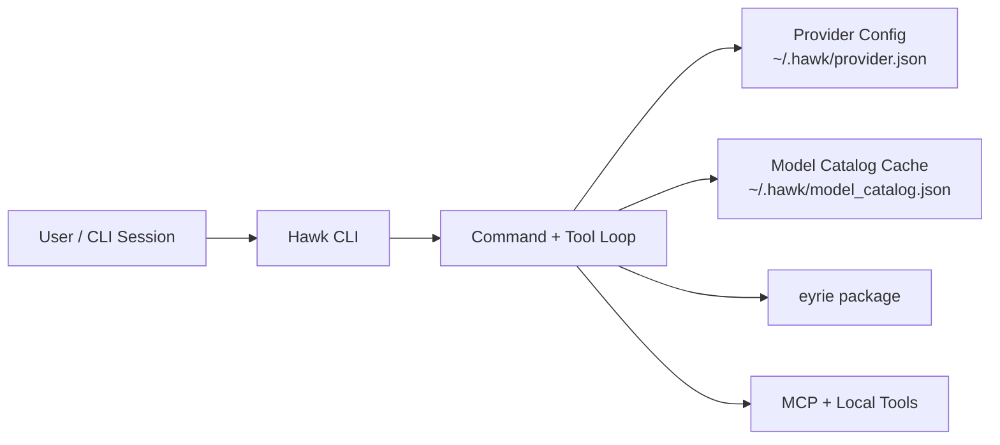
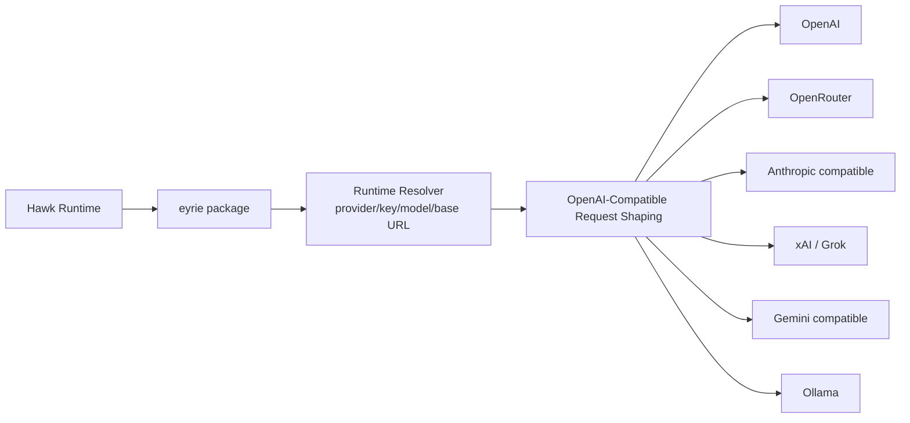

# Hawk Architecture

## System Overview

## Provider Request Flow

## Responsibility Split

- Hawk owns CLI UX, command routing, tools, sessions, and local persistence.
- Eyrie owns provider/runtime resolution, model catalog integration, and request shaping.
