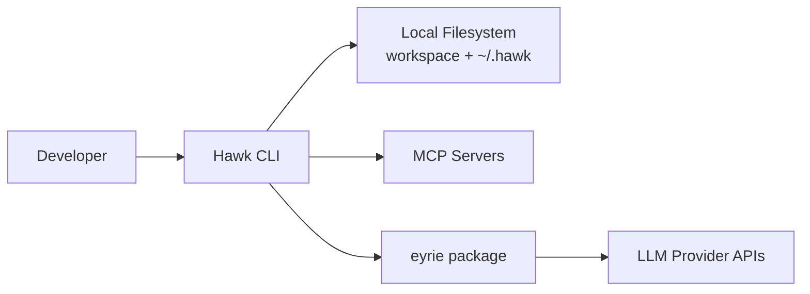
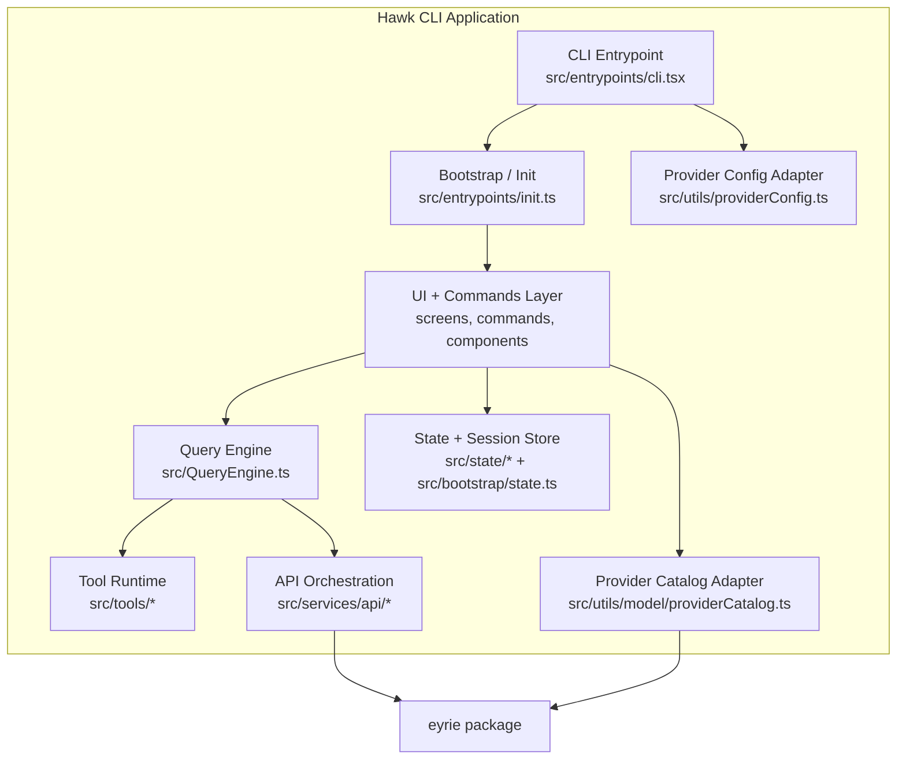
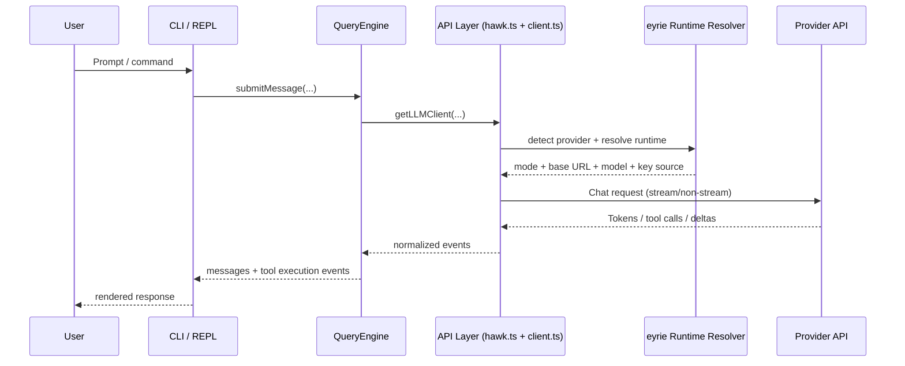
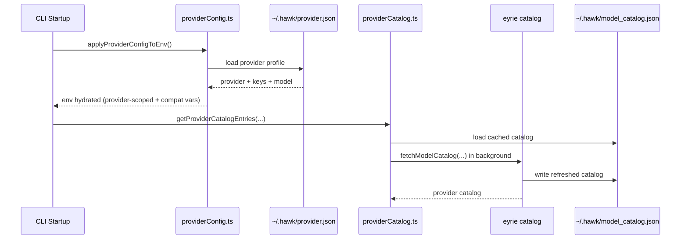

# Hawk Architecture

This document reflects the current code paths in `hawk` and the `@hawk/eyrie` integration used for provider/runtime and model catalog behavior.

## 1) Context (C4-L1)

## 2) Containers (C4-L2)

## 3) Core Runtime Flow (request path)

## 4) Provider Config + Model Catalog Flow

## 5) Responsibilities

- Hawk owns product runtime: CLI UX, command system, tool orchestration, app/session state, and local persistence.
- Eyrie owns provider/runtime concerns: provider detection, base URL/model/key resolution, provider catalogs, and compatibility shaping.
- The integration boundary is intentionally narrow: Hawk calls eyrie for provider/runtime/model intelligence and keeps product logic local.

## 6) Detailed Design

- See [COMPONENTS.md](./COMPONENTS.md) for C4-L3 component diagrams of Hawk critical modules.
- See ADRs in [docs/adr](./docs/adr/) for key architecture decisions.
