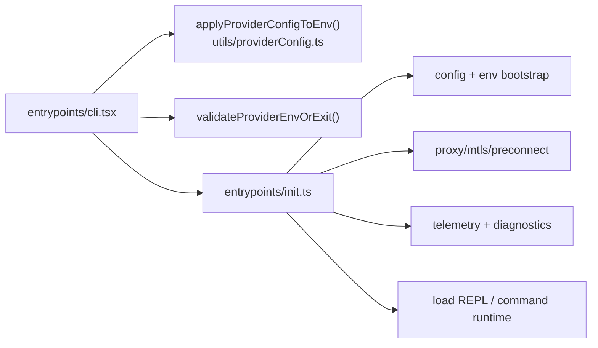
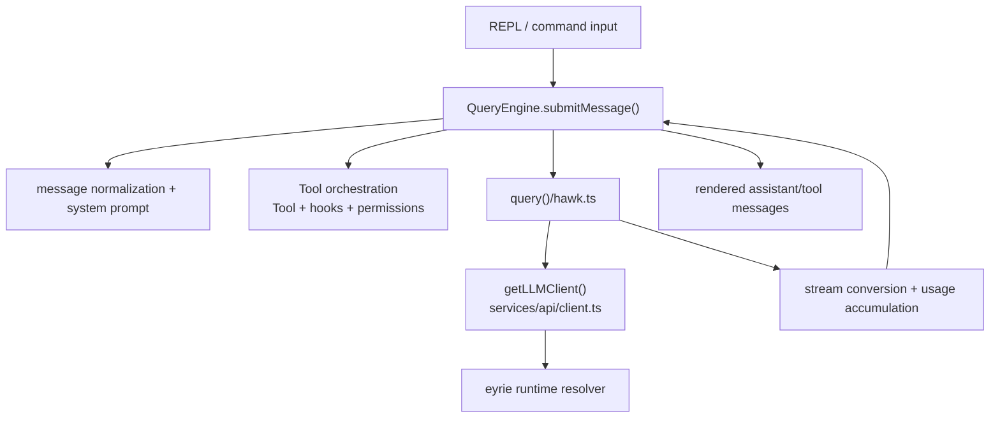
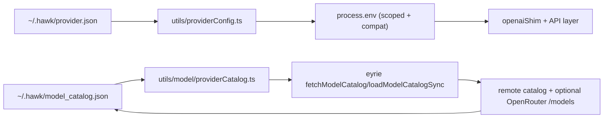
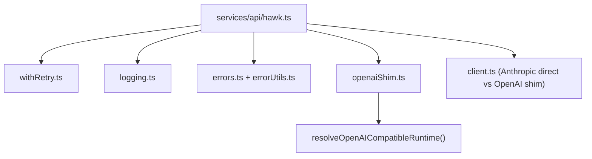

# Hawk Components (C4-L3)

This document expands Hawk’s internal architecture at component level for the most critical runtime paths.

## 1) CLI Bootstrap and Startup Path

## 2) Query Execution Pipeline

## 3) Provider Config and Catalog Components

## 4) API Layer Components (Critical)

## 5) Operational Boundaries

- Hawk core is product/runtime orchestration and is provider-agnostic above the API layer.
- Provider-specific behavior is delegated to eyrie and consumed through a stable integration surface.
- Local persistence boundaries are explicit: `~/.hawk/provider.json` and `~/.hawk/model_catalog.json`.
