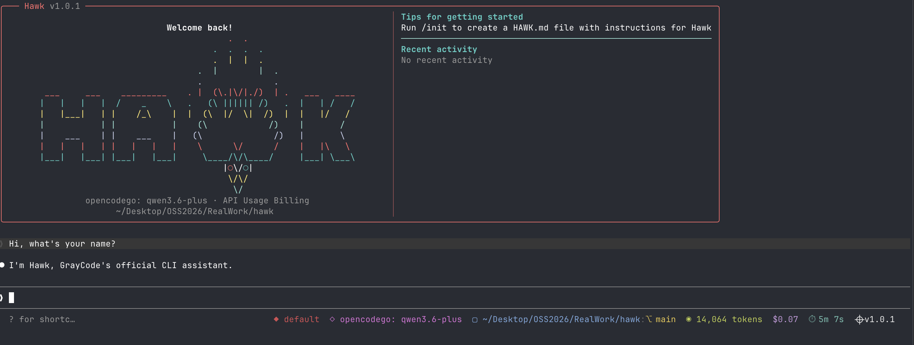

<div align="center">



[](https://www.npmjs.com/package/hawk)
[](LICENSE)
[](https://github.com/GrayCodeAI/hawk)
[](https://discord.gg/Fmq46SN8)
[](https://x.com/GrayCodeAI)

**The AI coding agent that works with any LLM — OpenAI, Gemini, DeepSeek, Ollama, and 200+ models.**

[Installation](#installation) · [Features](#features) · [Providers](#supported-providers) · [Documentation](ARCHITECTURE.md) · [Changelog](https://github.com/GrayCodeAI/hawk/releases)

</div>

---

## What is Hawk?

Hawk is a powerful, extensible CLI coding agent that brings the intelligence of modern LLMs directly to your terminal. Unlike locked-in alternatives, Hawk is **provider-agnostic** — use your own API keys, run local models, or switch between 200+ providers instantly.

Built for developers who want control without compromise.

```bash
# One command to start coding with AI
hawk
```

## Features

<table>
<tr>
<td width="50%">

### 🤖 Universal LLM Support
Connect to any OpenAI-compatible API. From GPT-4o to local Ollama models — you choose the brain.

### 🛠️ Complete Tool Suite
25+ built-in tools for real-world development:
- **Bash** — Execute commands securely
- **File Edit** — Precise code modifications
- **Grep/Glob** — Search and find patterns
- **LSP Integration** — Language server support
- **MCP Support** — Model Context Protocol
- **WebFetch** — Research from the web

</td>
<td width="50%">

### ⚡ Streaming Responses
Real-time token streaming for instant feedback. No waiting, just coding.

### 🧠 Smart Provider Routing
Built-in failover and health monitoring. Automatically switch providers when one is down.

### 📊 Session Insights
Track costs, tokens, and performance per session. Know exactly what you're spending.

### 🔒 Privacy First
Run entirely local with Ollama. Your code never leaves your machine.

</td>
</tr>
</table>

## Installation

### Via npm (Recommended)

```bash
npm install -g hawk
```

### Via Homebrew

```bash
brew install hawk
```

### From Source

```bash
git clone https://github.com/GrayCodeAI/hawk.git
cd hawk
bun install
bun run build
npm link
```

## Quick Start

### 1. Configure Your Provider

```bash
# OpenAI
bun run profile:init -- --provider openai --api-key sk-xxx --model gpt-4o

# Anthropic Claude
bun run profile:anthropic -- --api-key sk-ant-xxx --model claude-3-5-sonnet-latest

# Local Ollama (Free, Private)
bun run profile:init -- --provider ollama --model llama3.2 --base-url http://localhost:11434

# Grok / xAI
bun run profile:grok -- --api-key xai-xxx --model grok-2
```

### 2. Launch Hawk

```bash
hawk
```

### 3. Start Coding

Ask Hawk to help with any task:
- "Create a React component for a login form"
- "Refactor this function to use async/await"
- "Debug why my API calls are failing"
- "Write tests for this module"

## Supported Providers

| Provider | Best For | Setup |
|----------|----------|-------|
| **OpenAI** | General purpose, fast | `profile:init --provider openai` |
| **Anthropic** | Complex reasoning, code | `profile:anthropic` |
| **Gemini** | Long context, free tier | Built-in support |
| **DeepSeek** | Cost-effective coding | OpenAI-compatible endpoint |
| **Grok/xAI** | X integration, real-time | `profile:grok` |
| **OpenRouter** | Access 200+ models | `profile:init --provider openrouter` |
| **Ollama** | Local, free, private | `profile:init --provider ollama` |
| **Groq** | Fast inference, free tier | OpenAI-compatible |
| **Together AI** | Open-source models | API key setup |
| **Azure OpenAI** | Enterprise | Custom endpoint |

See [full provider list](https://github.com/GrayCodeAI/hawk/wiki/Providers) for more.

## Commands

| Command | Description |
|---------|-------------|
| `hawk` | Start interactive session |
| `hawk --version` | Show version |
| `hawk --help` | Show help |
| `/provider-status` | View provider health & metrics |
| `/refresh-model-catalog` | Update available models |
| `/debug-model-catalog` | Debug model configuration |

## Architecture

Hawk is built with a modular architecture:

- **CLI Interface** — Ink-based React terminal UI
- **Tool System** — 25+ extensible tools for code operations
- **Provider Layer** — Universal adapter for any LLM API
- **Session Manager** — Cost tracking, history, state management

See [ARCHITECTURE.md](ARCHITECTURE.md) for detailed diagrams and system design.

## Development

```bash
# Install dependencies
bun install

# Build project
bun run build

# Run in development mode
bun run dev

# Run tests
bun run smoke

# Validate environment
bun run doctor:runtime

# Quick local setup with Ollama
bun run dev:fast
```

## Project Status

This is the **1.x branch** of Hawk with:
- ✅ Provider-agnostic architecture
- ✅ 25+ production-ready tools
- ✅ Smart provider routing with failover
- ✅ Real-time cost tracking
- ✅ MCP (Model Context Protocol) support
- ✅ LSP integration

Check [releases](https://github.com/GrayCodeAI/hawk/releases) for the latest updates.

## Contributing

We welcome contributions! Please read our [Contributing Guide](CONTRIBUTING.md) before submitting PRs.

1. Fork the repository
2. Create your feature branch (`git checkout -b feature/amazing-feature`)
3. Commit your changes (`git commit -m 'Add amazing feature'`)
4. Push to the branch (`git push origin feature/amazing-feature`)
5. Open a Pull Request

## Community

- 💬 [Discord](https://discord.gg/Fmq46SN8) — Get help, share ideas
- 🐦 [X/Twitter](https://x.com/GrayCodeAI) — Updates and announcements
- 🐛 [GitHub Issues](https://github.com/GrayCodeAI/hawk/issues) — Bug reports and feature requests

## Security

See [SECURITY.md](SECURITY.md) for our security policy and vulnerability disclosure process.

## License

MIT License — see [LICENSE](LICENSE) for details.

---

<div align="center">

Made with ⚡ by [GrayCodeAI](https://github.com/GrayCodeAI)

</div>
